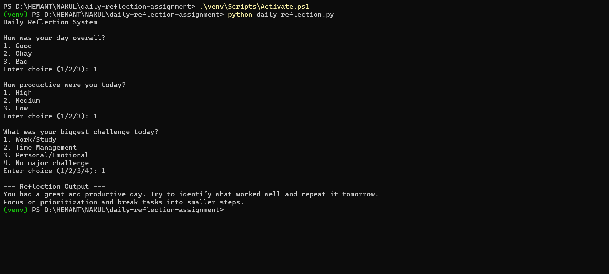

# Daily Reflection Decision Tree

This project implements a deterministic decision tree for a daily reflection system. The goal is to guide a user through a structured reflection about their day and provide meaningful insights based on their responses.

## Features

- Deterministic rule-based reflection system
- Daily mood and productivity analysis
- Challenge-aware reflection outputs
- Guardrails to ensure predictable behavior
- AI agent extension with keyword-based input handling
- Structured and context-aware decision logic
- Reliable outputs without generative AI

## Approach

The system is built using a rule-based decision tree. It asks the user three key questions:

1. Overall mood of the day (Good / Okay / Bad)
2. Productivity level (High / Medium / Low)
3. Main challenge faced (Work/Study, Time Management, Personal/Emotional, None)

Based on these inputs, the system follows predefined logical paths to generate a reflection output. The responses are deterministic, meaning the same inputs will always produce the same output.

## Decision Logic

The decision tree combines mood and productivity to determine the primary reflection. Additional refinement is applied based on the type of challenge faced during the day. This ensures that the output is both structured and context-aware.

## Guardrails

To reduce ambiguity and avoid unreliable outputs:
- The system uses fixed input options instead of free text
- Invalid inputs are handled with default values
- No probabilistic or AI-based responses are used
- All outputs are predefined and predictable

## How to Run

Clone the repository:

```bash
git clone https://github.com/nakul85/daily-reflection-tree.git
cd daily-reflection-tree
```

Run the deterministic decision tree:

```bash
python daily_reflection.py
```

Run the AI agent extension:

```bash
python agent_reflection.py
```

## Example Interaction

### Deterministic Reflection System

**Input:**

- Mood: Good
- Productivity: High
- Challenge: Time Management

**Output:**

```text
You had a productive day with a positive mindset.
Although you managed your tasks well, improving time management could help reduce stress and increase efficiency.
Keep building on today's momentum.
```

## Conclusion

This implementation demonstrates how a simple deterministic system can provide structured and meaningful reflections. It ensures clarity, consistency, and reliability without relying on generative AI.

## Part B: AI Agent Extension

An agent-based version of the system was implemented to handle more natural user inputs. Instead of fixed options, the agent accepts flexible text responses and maps them to structured categories using keyword-based detection.

Guardrails are implemented to ensure reliability:
- Inputs are mapped to predefined categories
- No free-form generation is used
- Outputs remain deterministic

## Demo

### Daily Reflection Output



This approach maintains control while improving usability.
